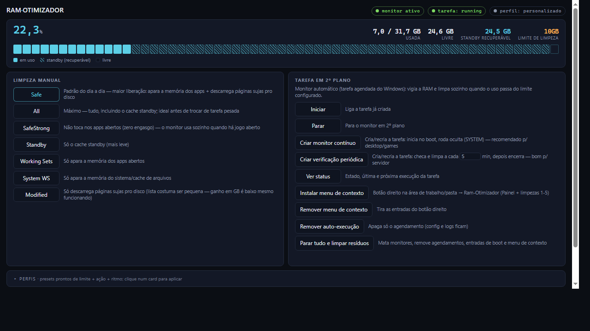

# 🎮 Ram-Otimizador — RAM cleaner and memory optimizer for Windows

[](https://github.com/Codyte/Ram-Otimizador/releases)
[](https://opensource.org/licenses/MIT)
[](https://www.microsoft.com/powershell)
[](https://www.microsoft.com/windows)
[](https://github.com/Codyte/Ram-Otimizador)
[](https://github.com/Codyte/Ram-Otimizador/fork)

🇧🇷 [Versão em português](README.md)

**Automatic memory monitor: when RAM usage crosses your configured threshold, it cleans on its own — via the native Windows API, with every cleanup logged to CSV.**

A PowerShell RAM cleaner for Windows 10/11: trims app working sets and flushes dirty pages using `NtSetSystemInformation` (no external programs), with anti-stutter game detection, local graphical panel, and 7 ready-made profiles.

Perfect for: **Gamers** 🎮 • **Content Creators** 🎬 • **24/7 Servers** 🖥️ • **Low-RAM Laptops** 💻



> **Note:** the app UI and menus are currently in Portuguese (pt-BR). English UI is on the contribution wishlist below.

---

## 📊 Tests so far

Every cleanup is recorded in `logs/cleanup-history.csv`. Results of **209 cleanups** on the development machine (32GB RAM):

| Action | What it does | Median freed | Max | N |
|--------|--------------|--------------|-----|---|
| **Safe** (default) | Working Sets → Modified | **3.3 GB** | 7.7 GB | 171 |
| All | Everything, incl. standby cache | 0.8 GB | 4.2 GB | 8 |
| Working Sets | Trims app memory only | 0.7 GB | 2.1 GB | 10 |
| SafeStrong | Modified + Standby (doesn't touch apps) | 0.4 GB | 0.4 GB | 2 |
| Modified | Flushes dirty pages only | 0.3 GB | 1.3 GB | 15 |
| Standby | Standby cache only | ~0 | ~0 | 3 |

**Read carefully:** `Safe` is the default because it's what actually frees memory. `SafeStrong` frees little — its value is **not touching open apps** (zero hitching), which is why the monitor swaps `All`→`SafeStrong` while a game runs.

Your numbers will vary with hardware and load. Run it and check your own CSV.

---

## 📌 What to expect

- **Relieves memory pressure.** When RAM runs near the limit (80%+), the system starts paging and hitching; freeing memory in that scenario reduces paging and the stalls it causes. With comfortable RAM the effect is small.
- **Nothing gets closed.** Cleaning acts on cache and working sets; your programs stay open and running.
- **Disk consequence:** flushing Modified writes dirty pages to disk (they'd go there anyway on the next paging); the cooldown limits how often this happens.
- **Where it helps most:** 8-16GB machines under load (game + browser + Discord), servers that degrade over time, and heavy video/3D editing.

---

## ✅ What it DOES (all of it in the code)

- **Automatic monitor** (scheduled task, runs as SYSTEM, invisible): cleans when RAM crosses the threshold, with band hysteresis (no cleaning loops) and a configurable cooldown.
- **Real anti-stutter:** with a game or creative app open, `All`/`Safe` actions become `SafeStrong` automatically (they don't touch the game's working set). Detected list: Rust, Warzone, Battlefield, GTA, Blender, Premiere, Discord, OBS and more.
- **Native engine:** direct `NtSetSystemInformation` — no external program required. RAMMap (Sysinternals) is only an optional fallback.
- **Local graphical panel** (screenshot above): manual cleanup, profiles, config, logs, RAM chart of the last hours with cleanup marks. Local HTTP server with a session token.
- **7 ready-made profiles** + automatic recommendation that inspects your hardware.
- **Everything logged:** daily log + per-cleanup history CSV (before/after/GB).

---

## 🚀 Quick Start (2 minutes)

### 1. Install (1 line in PowerShell)
```powershell
irm https://raw.githubusercontent.com/Codyte/Ram-Otimizador/master/install.ps1 | iex
```
Downloads the latest version, installs to `%LOCALAPPDATA%\Ram-Otimizador` (updates preserve your config) and opens the panel.

<details><summary>Prefer git clone?</summary>

```powershell
git clone https://github.com/Codyte/Ram-Otimizador.git
cd Ram-Otimizador
```
</details>

### 2. Run
```
Double-click INICIAR.bat → opens the graphical panel (self-elevates via UAC)
Prefer the classic console menu? INICIAR.bat cmd
```

### 3. Pick a profile and enable the monitor
```
In the panel: "Perfis" section → click a card (or "Analisar sistema" for a recommendation)
Then: "Criar monitor contínuo" → done, your PC manages its own RAM.
```

---

## ⚙️ Profiles (actual values from the code)

| Profile | Threshold | Action | Check | Cooldown | Who it's for |
|---------|-----------|--------|-------|----------|--------------|
| **equilibrado** | 82% | Safe | 30s | 120s | Everyday desktop |
| **games** | 80% | Safe* | 15s | 60s | Gaming (*becomes SafeStrong with a game open) |
| **servidor-24-7** | 90% | Safe | 60s | 300s | Servers: rare and light |
| **workstation-criacao** | 88% | SafeStrong | 30s | 180s | Video/3D editing (won't trim your editors) |
| **low-ram** | 72% | Safe | 20s | 90s | Machines with ≤8GB |
| **economia-bateria** | 90% | Safe | 120s | 600s | Laptop on battery |
| **agressivo-maximo** | 65% | All | 15s | 45s | Max free RAM at any cost |

Every profile also sets hysteresis, minimum standby and log level. Edited any value by hand? The profile becomes `personalizado` (custom).

---

## 🔧 Clean actions explained

- **Safe** (default) — Working Sets → Modified. Largest real gain (3.3GB median in our logs) and **preserves the disk cache** (standby).
- **All** — everything: Working Sets → System WS → Modified → Standby. Use before opening a heavy task. Purging standby throws away cache Windows would reuse.
- **SafeStrong** — Modified + Standby, **without touching open apps**. Frees little, but zero hitching — the anti-stutter mode the monitor uses while a game runs.
- **Standby / Working Sets / System WS / Modified** — each step isolated, to test the effect on your machine.

---

## 💻 Classic console menu

```
1 - Analyze system and recommend a profile
2 - Choose a ready-made profile
3 - Start continuous MONITOR (foreground)
4 - Quick manual cleanup
5 - Live dashboard
6 - Auto-run / scheduling / context menu
7 - Test system (permissions, files)
8 - Today's logs
9 - Edit configuration (JSON)
```

---

## ❓ FAQ

**Q: Will it kill my open programs?**
A: No. It cleans cache and trims working sets; nothing is closed.

**Q: Will I gain FPS?**
A: If your RAM lives near the limit while gaming, reducing pressure avoids paging and the hitches it causes. With comfortable RAM the effect is small.

**Q: Which cleanup frees the most?**
A: `Safe` (the default): trims working sets and flushes modified — 3.3GB median in our logs. Purging only standby frees almost nothing, because Windows already releases that cache on demand.

**Q: Does it need admin?**
A: Yes — the cleanup API requires it. The panel self-elevates via UAC; the scheduled task runs as SYSTEM without bothering you.

**Q: Does it work with 8GB?**
A: Yes, that's where it helps most (`low-ram` profile). With little RAM the pressure is constant.

**Q: What about my SSD?**
A: Transparency: flushing Modified *writes* dirty pages to disk (they'd go there anyway on the next paging). The cooldown exists precisely so this doesn't happen constantly.

---

## 🐛 Troubleshooting

### "Won't open / does nothing"
1. PowerShell as Admin: `Set-ExecutionPolicy -ExecutionPolicy RemoteSigned -Scope CurrentUser -Force`
2. Run `INICIAR.bat` again (accept the UAC prompt)

### "Background cleanup doesn't free RAM"
The task runs as SYSTEM. Panel → "Criar monitor contínuo" (recreates the task).

### "The monitor never cleans"
Check the threshold (`ThresholdClean`) vs your actual usage, and today's log (panel or `Menu > 8`).

### Want more aggressiveness?
Panel → Configuration → threshold 70-75%, or apply the `agressivo-maximo` profile.

---

## 🤖 For AI agents and automation

Non-interactive install (PowerShell, Windows 10/11):

```powershell
irm https://raw.githubusercontent.com/Codyte/Ram-Otimizador/master/install.ps1 | iex
```

- Installs to `%LOCALAPPDATA%\Ram-Otimizador`; updates preserve `config/` and `logs/`.
- Cleaning requires elevation (UAC): `INICIAR.bat` and the panel self-elevate; the scheduled task runs as SYSTEM.
- Command-line manual cleanup (admin): `scripts\LimparRAM-Inteligente.ps1 -Clean Safe` (actions: `Safe|All|SafeStrong|Standby|WorkingSets|SystemWorkingSets|ModifiedPageList`).
- Config at `config/RamCleanerConfig.json` (schema and limits in `scripts/RamCommon.ps1`); per-cleanup results in `logs/cleanup-history.csv`.
- Machine-readable summary: [`llms.txt`](llms.txt).

---

## 🛠️ Tech

PowerShell (82%) + vanilla HTML/CSS/JS panel (16%). No external dependencies, no telemetry, no weird installer — it's scripts, you can read everything.

Quality: config regression tests + PSScriptAnalyzer run in CI on every push.

---

## 🤝 Contributing

- [ ] **English UI** — the panel and menus are pt-BR today
- [ ] **More games in detection** — the list lives in `scripts/RamCommon.ps1` (`$Global:RamGameApps`)
- [ ] **A real FPS benchmark** — if you can measure frametimes before/after rigorously, this is the most valuable contribution there is
- [ ] **Notifications** — webhook/Discord on cleanup

**How to join:** [CONTRIBUTING.md](CONTRIBUTING.md)

---

## 📝 License

MIT — use it freely.

---

**Made with ❤️ in Brazil. The numbers in this README come from the code and from `logs/cleanup-history.csv`.**
**v1.0** — 2026-07-13
